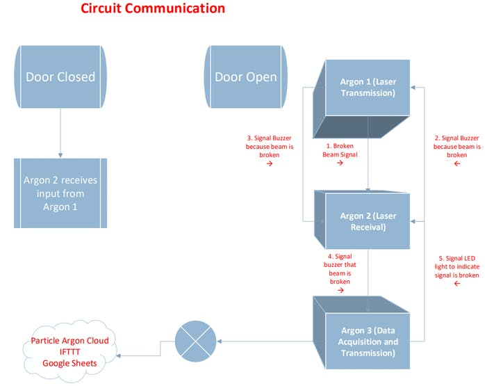

# Mini-task-2-CFI-IITM

# Project 1 : IOT Home Security System with Particle Argon

**Problem Statement** - Get notifications when your house door is opened, Home Security at the touch of your fingers! 

**Ideation** -

**Understand the device mechanism** -

1. **Laser Transmission Circuit**

Particle Argon --> breadboard

Argon 3v3 --> positive power rail and Argon ground to negative power rail

Laser emitter --> small breadboard and jump laser ports to power, ground, and pin D0, respectively

Connect buzzer --> main breadboard and jump buzzer ports to power, ground, and pin D4, respectively

2. **Laser Receiving Circuit**

Particle Argon --> main breadboard

Argon 3v3 --> positive power rail and Argon ground to negative power rail

Photoresistor to small breadboard and jump laser ports to power, ground, and pin D0, respectively

Buzzer --> main breadboard and jump buzzer ports to power, ground, and pin D8, respectively

Led --> main breadboard, with the positive lead in pin D9, the negative lead in a row on its own, and a resistor jumping the negative lead to the ground rail

3. **Data Acquisition and Transmission Circuit**

ParticleArgon --> main breadboard

Argon 3v3 --> positive power rail and Argon ground to negative power rail

Buzzer --> main breadboard and jump buzzer ports to power, ground, and pin D4, respectively

# Project 2 : Ambient Sound Light Show

**Problem Statement** - Using frequency content we will analyze ambient sound and display it on strip of LEDs

**Ideation** -

**Understand the device mechanism** -

Electret microphone -> 2k2 bias resistor

SPI buss connections -> DotStar LED strip and an analog pot input

Arduino IDE + Sony Spresense board -> serial port with a terminal to get a reading on the processing time
 
|Parts Used                   | Replacable with | Advantages | Disadvantage|
|-----------------------------|-----------------|------------|-------------|
|Sony Spresense boards |(main & extension)|Very efficient| Costly|
|Adafruit dotstart LED strip  |Citra LED strip  |It's cheap  |    --       |
|Electret microphone          |       --        |Auto gain control|   --   |
|Rotary potentiometer         |       --        |High efficiency | --   |

Things on which we could work to make device more efficient:
* Instead of Adafruit dotstar LED strip which costs 3800 inr we could use Citra LED strip which costs 300 inr and works same.
* Before connecting to amplifier we will use isolation transformer so that it will clear out any noise present...
